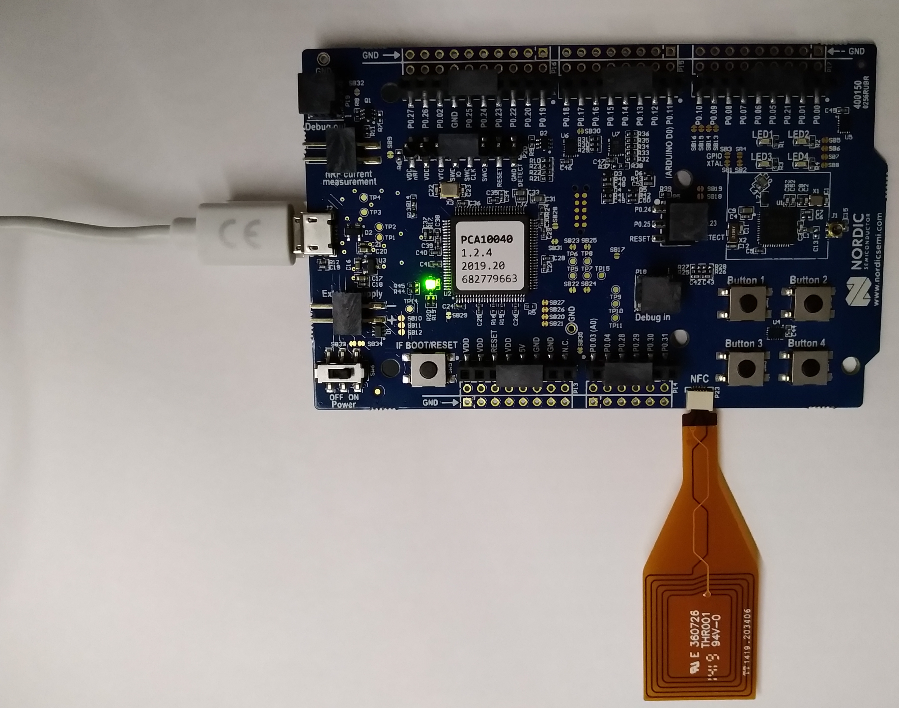

# Docker Container Description: Zephyr, nRF52 PCA10040

Contains a Dockerfile for building an docker image and its container for zephyr.

Setup for Nordic nRF52 PCA10040 board (Embedded Linux Conference Europe, Lyon 2019).

Implicitely will run ```git clone https://github.com/Rubusch/zephyr.git``` inside the docker container.





## Resources

https://docs.zephyrproject.org/latest/boards/arm/nrf52_pca10040/doc/index.html

Configuration of the necessary software: building and flashing of nordic boards (via segger).
https://docs.zephyrproject.org/latest/guides/tools/nordic_segger.html

gcc-arm-none-eabi toolchain documentation
https://docs.zephyrproject.org/latest/getting_started/toolchain_3rd_party_x_compilers.html?highlight=gnuarmemb

download of original gcc-arm-none-eabi toolchain (link seems down, tar.gz)
https://developer.arm.com/-/media/Files/downloads/gnu-rm/8-2019q3/RC1.1/gcc-arm-none-eabi-8-2019-q3-update-linux.tar.bz2

download of original nRF command line tools (tar.gz)
https://www.nordicsemi.com/-/media/Software-and-other-downloads/Desktop-software/nRF-command-line-tools/sw/Versions-10-x-x/nRFCommandLineTools1041Linuxamd64tar.gz

download of original JLink (segger, .deb)
https://www.segger.com/downloads/jlink/JLink_Linux_x86_64.deb


## Build

```
$ cd ./docker/
$ time docker build --build-arg USER=$USER -t rubuschl/zephyr-nrf52:$(date +%Y%m%d%H%M%S) .
```


## Usage

```
$ docker images
    REPOSITORY               TAG                 IMAGE ID            CREATED             SIZE
    rubuschl/zephyr-nrf52    20191104161353      cbf4cb380168        24 minutes ago      10.5GB
    ubuntu                   xenial              5f2bf26e3524        4 days ago          123MB

$ time docker run --rm -ti --user=$USER:$USER --workdir=/home/$USER -v $PWD/output:/mnt rubuschl/zephyr-nrf52:20191104161353
```


## Debug

**NOTE**: ``--privileged`` mode is not _safe_, the docker container is supposed rather to allow for archiving of the toolchain. Append ``/bin/bash`` to enter the current container for debugging.


## Target

Building the board support package (bsp) for the target, e.g. the nRF52 PCA10040 eval board

```
docker $> ./build.sh
docker $> source ~/env.sh
docker $> cd ~/zephyrproject
docker $> west build -b nrf52_pca10040 zephyr/samples/bluetooth/beacon
```

Flashing the target

```
docker $> west flash --erase
```

Use the /dev/ttyACM0 device for debugging the target.
